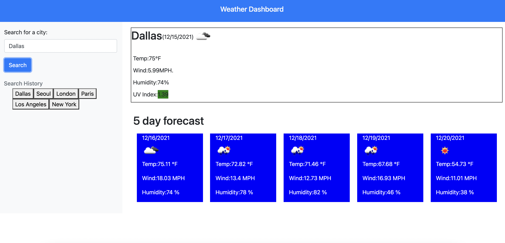

# Weather Dashboard

## Description

This application allows the user to search a city and obtain the current weather condiitons as well as a 5-day forecast with data obtained from the OpenWeather API so the user has information about the temperature, wind speed and humidity.

The website also includes the current day UV information with a color that can help you easily identify the level based on the UV index

The user can also see the previously searched cities and click on them for quickly searching them again.

## Website Appearance 

## [Published Site](https://dinoabrego.github.io/weather-dashboard)

## Sources

Open Weather API:
https://openweathermap.org/api

UV index scale:
https://www.epa.gov/sunsafety/uv-index-scale-0